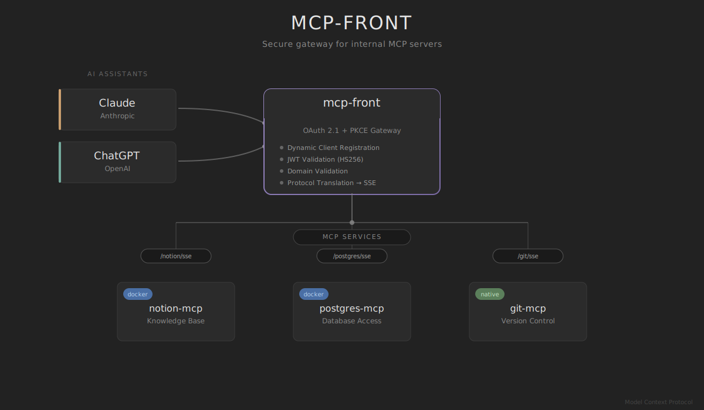

# mcp-front

> **This project is a work in progress and should not be considered production ready.**
> Though I'm fairly confident the overall architecture is sound, and I myself rely on the implementation, so it _should work :tm:_.
> But it's definitely alpha software :)
>
> Also, don't rely too much on the docs, they drift fairly quickly, I do not always keep them updated when doing changes or adding/removing features. They are mostly here to anchor me and help me stay focus on my initial vision.

OAuth 2.1 authentication proxy for multiple MCP (Model Context Protocol) servers. Enables secure Claude.ai integration with comprehensive testing.

<div align="center">



</div>


## How it works

mcp-front sits between Claude.ai and your MCP servers, handling OAuth 2.1 authentication with PKCE and GCP IAM domain validation. Claude.ai connects to multiple MCP servers through a single authenticated endpoint.

When Claude.ai first connects, users authenticate via Google OAuth. mcp-front validates their domain against your allowed list and issues tokens for accessing MCP servers. Subsequent requests use bearer tokens, eliminating repeated authentication.

## Configuration

Create `config.json` based on `config-oauth.json`:

```json
{
  "mcpProxy": {
    "baseURL": "https://mcp.yourcompany.com",
    "addr": ":8080",
    "name": "Company MCP Front",
    "version": "1.0.0"
  },
  "oauth": {
    "issuer": "https://mcp.yourcompany.com",
    "gcp_project": "your-gcp-project",
    "allowed_domains": ["yourcompany.com"],
    "token_ttl": "1h",
    "storage": "memory",
    "google_client_id": "${GOOGLE_CLIENT_ID}",
    "google_client_secret": "${GOOGLE_CLIENT_SECRET}",
    "google_redirect_uri": "https://mcp.yourcompany.com/oauth/callback"
  },
  "mcpServers": {
    "notion": {
      "command": "docker",
      "args": ["run", "--rm", "-i", "mcp/notion:latest"],
      "env": { "NOTION_TOKEN": "${NOTION_TOKEN}" }
    },
    "postgres": {
      "command": "docker",
      "args": ["run", "--rm", "-i", "mcp/postgres:latest"],
      "env": { "DATABASE_URL": "${DATABASE_URL}" }
    },
    "external": {
      "url": "https://api.example.com/mcp",
      "headers": { "Authorization": "Bearer ${API_TOKEN}" }
    }
  }
}
```

## Environment setup

Set these environment variables:

```bash
export GOOGLE_CLIENT_ID="your-oauth-client-id"
export GOOGLE_CLIENT_SECRET="your-oauth-client-secret"
export JWT_SECRET="your-32-byte-jwt-secret-for-oauth!"
export NOTION_TOKEN="your-notion-token"
export DATABASE_URL="postgresql://..."

# Optional: Set development mode for testing
export MCP_FRONT_ENV="development"

# Optional: Configure structured logging
export LOG_LEVEL="info"         # debug, info, warn, error
export LOG_FORMAT="json"        # json or text
```

## Google OAuth setup

1. Go to [Google Cloud Console](https://console.cloud.google.com/) → APIs & Services → Credentials
2. Create OAuth 2.0 Client ID (Web application)
3. Add authorized redirect URI: `https://mcp.yourcompany.com/oauth/callback`
4. Note the Client ID and Secret for your environment variables

## Running

Local development:

```bash
git clone https://github.com/dgellow/mcp-front.git
cd mcp-front
go build -o mcp-front ./cmd/mcp-front
./mcp-front -config config.json
```

Docker:

```bash
# Using Docker Hub image (use specific SHA tag)
docker run -d -p 8080:8080 \
  -e GOOGLE_CLIENT_ID="your-oauth-client-id" \
  -e GOOGLE_CLIENT_SECRET="your-oauth-client-secret" \
  -e JWT_SECRET="your-32-byte-jwt-secret-for-oauth!" \
  -v /var/run/docker.sock:/var/run/docker.sock \
  -v $(pwd)/config.json:/app/config.json \
  dgellow/mcp-front:main-a734cfc

# Or build locally
docker build -t mcp-front .
docker run -d -p 8080:8080 \
  -e GOOGLE_CLIENT_ID="your-oauth-client-id" \
  -e GOOGLE_CLIENT_SECRET="your-oauth-client-secret" \
  -e JWT_SECRET="your-32-byte-jwt-secret-for-oauth!" \
  -v /var/run/docker.sock:/var/run/docker.sock \
  -v $(pwd)/config.json:/app/config.json \
  mcp-front
```

### Running mcp-front with Docker client included

If you need mcp-front to run Docker commands (for MCP servers configured with `command: "docker"`), use the Docker client image:

```bash
# Build the Docker client image
docker build -f Dockerfile.docker-client -t mcp-front:docker-client .

# Run with Docker socket mounted
docker run -d -p 8080:8080 \
  -e GOOGLE_CLIENT_ID="your-oauth-client-id" \
  -e GOOGLE_CLIENT_SECRET="your-oauth-client-secret" \
  -e JWT_SECRET="your-32-byte-jwt-secret-for-oauth!" \
  -v /var/run/docker.sock:/var/run/docker.sock:ro \
  -v $(pwd)/config.json:/app/config.json:ro \
  --group-add $(stat -c '%g' /var/run/docker.sock) \
  mcp-front:docker-client

# Or use docker-compose
docker-compose -f docker-compose.docker-client.yml up -d
```

This variant includes the Docker CLI, allowing mcp-front to spawn Docker containers for MCP servers.

## Testing

Run the comprehensive integration test suite:

```bash
cd integration
go test -v
```

This validates:

- **OAuth 2.1 Integration**: JWT secret validation, client registration, state parameter handling
- **Security Testing**: Authentication bypass protection, development vs production modes
- **MCP Communication**: End-to-end stdio and SSE transport
- **Claude.ai Compatibility**: Dynamic client registration (RFC 7591), PKCE flows
- **Environment Configuration**: Development mode features, structured logging
- **CORS and Headers**: Proper browser compatibility

Run specific OAuth tests:

```bash
cd integration
go test -v -run TestOAuthFlowIntegration
```

## Claude.ai integration

Add these MCP server URLs to Claude.ai:

```
https://mcp.yourcompany.com/notion/sse
https://mcp.yourcompany.com/postgres/sse
https://mcp.yourcompany.com/external/sse
```

Claude.ai will discover the OAuth endpoints automatically and prompt for authentication on first use.

## GCP deployment

Build and deploy to Google Cloud Run or Compute Engine:

```bash
# Build image
docker build -t gcr.io/${PROJECT_ID}/mcp-front .
docker push gcr.io/${PROJECT_ID}/mcp-front

# Deploy to Cloud Run
gcloud run deploy mcp-front \
  --image gcr.io/${PROJECT_ID}/mcp-front \
  --platform managed \
  --allow-unauthenticated \
  --port 8080
```

For production, use a load balancer with HTTPS termination and mount Docker socket for stdio-based MCP servers.

## OAuth endpoints

- `/.well-known/oauth-authorization-server` - Server metadata discovery
- `/authorize` - Authorization code flow with PKCE
- `/token` - Token exchange and refresh
- `/oauth/callback` - Google OAuth callback
- `/register` - Dynamic client registration

## Security

All authorization flows require PKCE. Users must belong to Google Workspace domains in the `allowed_domains` list. Tokens are scoped to MCP endpoints and expire based on `token_ttl` configuration.

The system includes protection against:

- Authentication bypass attempts
- HTTP header injection
- Path traversal attacks
- Malformed authentication headers

⚠️ **Important Security Note**: mcp-front acts as an authentication proxy and does **NOT** provide protection against SQL injection, command injection, or other attacks that may be possible through individual MCP servers. Each MCP server is responsible for its own input validation and security. Carefully review the security practices of any MCP servers you deploy, as they will have access to your backend systems after OAuth authentication.

## Storage Options

OAuth client data can be stored using different backends:

### Memory Storage (Development)

```json
{
  "oauth": {
    "storage": "memory"
  }
}
```

- Default option, suitable for development and testing
- All client registrations lost on restart
- Fast, no external dependencies

### Firestore Storage (Production)

```json
{
  "oauth": {
    "storage": "firestore",
    "gcp_project": "your-gcp-project",
    "firestore_database": "my-firestore-db", // Optional, defaults to "(default)"
    "firestore_collection": "custom_oauth_clients" // Optional, defaults to "mcp_front_oauth_clients"
  }
}
```

- Production-ready persistent storage
- Requires GCP Firestore enabled in your project
- Automatic authentication via service accounts or ADC
- Client registrations survive restarts
- Hybrid architecture: Firestore for persistence + in-memory cache for performance
- Configurable database and collection names for multi-environment setups

## Architecture

mcp-front is built as a single Go binary with clean separation of concerns:

- `main.go` - Application entry point and configuration loading
- `http.go` - HTTP server with structured logging and CORS middleware
- `client.go` - MCP client implementation with stdio/SSE bridge
- `oauth/` - OAuth 2.1 server implementation with fosite
- `internal/` - Centralized structured logging with Go's slog
- `integration/` - Comprehensive test suite with OAuth flow validation

The OAuth implementation uses:

- [ory/fosite](https://github.com/ory/fosite) for OAuth 2.1 compliance
- Google OAuth for user authentication with domain validation
- In-memory storage with thread-safe client management
- Dynamic client registration following RFC 7591
- Public client support for MCP Inspector compatibility
- Environment-based security configuration (dev vs production)
- HMAC-SHA512/256 JWT signing with 32-byte secret requirement

## Project Status

✅ **Production Ready Features:**

- OAuth 2.1 with PKCE support and fosite compliance
- Claude.ai and MCP Inspector compatibility (tested)
- Dynamic client registration with public client support
- Thread-safe client storage with mutex protection
- Structured logging with Go's standard slog package
- Environment-based configuration (development vs production)
- JWT secret length validation (32-byte requirement)
- State parameter entropy handling
- CORS headers for browser compatibility
- Comprehensive OAuth integration test suite
- Security scenario validation and bypass protection
- GCP domain validation with Google Workspace integration

🔧 **Testing & Development:**

- OAuth flow integration tests covering JWT validation, client registration, state handling
- Environment-based test scenarios (MCP_FRONT_ENV)
- Mock database setup with Docker Compose
- Automated CI-ready test runner with health checks
- Development mode for debugging OAuth clients
- See `CLAUDE.md` for detailed implementation guide
