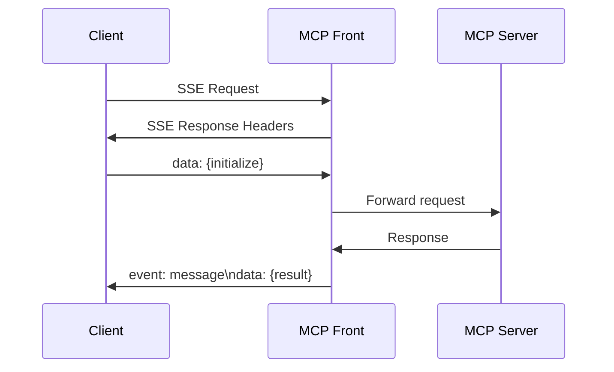

import { Aside, Code } from '@astrojs/starlight/components';

MCP Front uses Server-Sent Events (SSE) to proxy communication between Claude.ai and MCP servers.

## SSE Endpoints

### Main SSE Endpoint

<div class="api-endpoint">
  <span class="api-method get">GET</span>
  <code>/sse</code>
</div>

Base SSE endpoint when only one MCP server is configured.

**Headers**
```
Authorization: Bearer {token}
Accept: text/event-stream
Cache-Control: no-cache
```

### Server-Specific Endpoints

<div class="api-endpoint">
  <span class="api-method get">GET</span>
  <code>/{server-name}/sse</code>
</div>

Access specific MCP servers when multiple are configured.

**Example**
```bash
# Access database MCP server
curl -H "Authorization: Bearer token123" \
     -H "Accept: text/event-stream" \
     https://mcp.company.com/database/sse

# Access GitHub MCP server  
curl -H "Authorization: Bearer token123" \
     -H "Accept: text/event-stream" \
     https://mcp.company.com/github/sse
```

## SSE Message Format

### Event Structure

```
event: {event-type}
data: {json-payload}
id: {optional-message-id}

```

<Aside type="tip">
  Each SSE message ends with two newlines. The `data` field contains JSON-encoded MCP protocol messages.
</Aside>

### Event Types

| Event | Description |
|-------|-------------|
| `message` | Standard MCP protocol message |
| `error` | Error from MCP server |
| `ping` | Keep-alive ping |
| `close` | Connection closing |

## MCP Protocol Messages

### Initialize Connection

**Client → Server**
```
data: {"jsonrpc":"2.0","method":"initialize","params":{"protocolVersion":"0.1.0","capabilities":{"tools":{}}},"id":1}
```

**Server → Client**
```
event: message
data: {"jsonrpc":"2.0","result":{"protocolVersion":"0.1.0","capabilities":{"tools":{}},"serverInfo":{"name":"database-mcp","version":"1.0.0"}},"id":1}

```

### List Available Tools

**Client → Server**
```
data: {"jsonrpc":"2.0","method":"tools/list","params":{},"id":2}
```

**Server → Client**
```
event: message
data: {"jsonrpc":"2.0","result":{"tools":[{"name":"query_database","description":"Execute SQL query","inputSchema":{"type":"object","properties":{"query":{"type":"string"}},"required":["query"]}}]},"id":2}

```

### Execute Tool

**Client → Server**
```
data: {"jsonrpc":"2.0","method":"tools/call","params":{"name":"query_database","arguments":{"query":"SELECT * FROM users LIMIT 10"}},"id":3}
```

**Server → Client**
```
event: message
data: {"jsonrpc":"2.0","result":{"content":[{"type":"text","text":"Found 10 users:\n1. Alice\n2. Bob..."}]},"id":3}

```

## Connection Management

### Connection Lifecycle

1. **Authentication**: Bearer token or OAuth token validated
2. **SSE Handshake**: Client establishes SSE connection
3. **MCP Initialize**: Client sends initialize message
4. **Message Exchange**: Bidirectional communication via SSE
5. **Termination**: Client closes or timeout occurs

### Keep-Alive

MCP Front sends periodic ping events:

```
event: ping
data: {"timestamp":"2024-01-15T10:30:00Z"}

```

<Aside type="tip">
  Clients should handle ping events to detect connection health. No response is required.
</Aside>

### Reconnection

SSE supports automatic reconnection:

```javascript
const eventSource = new EventSource('/sse', {
  headers: {
    'Authorization': 'Bearer ' + token
  }
});

eventSource.onerror = (error) => {
  // EventSource will automatically reconnect
  console.log('Connection lost, reconnecting...');
};
```

## Error Handling

### Connection Errors

```
HTTP/1.1 401 Unauthorized
Content-Type: application/json

{"error":"invalid_token","error_description":"Token expired"}
```

### Protocol Errors

```
event: error
data: {"error":{"code":-32700,"message":"Parse error","data":"Invalid JSON"}}

```

### MCP Errors

```
event: message
data: {"jsonrpc":"2.0","error":{"code":-32601,"message":"Method not found","data":"Unknown method: tools/invalid"},"id":4}

```

## Request/Response Flow

### Synchronous Operations

Most MCP operations are request/response:



### Streaming Responses

Some tools may stream responses:

```
event: message
data: {"jsonrpc":"2.0","result":{"content":[{"type":"text","text":"Processing..."}],"isPartial":true},"id":5}

event: message  
data: {"jsonrpc":"2.0","result":{"content":[{"type":"text","text":"Step 1 complete\n"}],"isPartial":true},"id":5}

event: message
data: {"jsonrpc":"2.0","result":{"content":[{"type":"text","text":"Step 1 complete\nStep 2 complete\nDone!"}],"isPartial":false},"id":5}

```

## Performance Considerations

### Connection Limits

- Maximum concurrent SSE connections: 1000 per instance
- Maximum message size: 1MB
- Connection timeout: 24 hours
- Idle timeout: 30 minutes

### Buffering

SSE connections are unbuffered for real-time communication:

```nginx
# Nginx configuration
location ~ /(.+)/sse$ {
    proxy_pass http://mcp-front:8080;
    proxy_buffering off;
    proxy_cache off;
    proxy_set_header Connection '';
    proxy_http_version 1.1;
    chunked_transfer_encoding off;
}
```

### Compression

SSE data is not compressed to maintain streaming:

```
Content-Encoding: identity
X-Accel-Buffering: no
```

## Client Implementation

### JavaScript/TypeScript

<Code code={`class MCPClient {
  constructor(url, token) {
    this.url = url;
    this.token = token;
    this.messageId = 0;
    this.pendingRequests = new Map();
  }
  
  connect() {
    this.eventSource = new EventSource(this.url, {
      headers: {
        'Authorization': \`Bearer \${this.token}\`,
        'Accept': 'text/event-stream'
      }
    });
    
    this.eventSource.onmessage = (event) => {
      const message = JSON.parse(event.data);
      if (message.id && this.pendingRequests.has(message.id)) {
        const { resolve, reject } = this.pendingRequests.get(message.id);
        this.pendingRequests.delete(message.id);
        
        if (message.error) {
          reject(message.error);
        } else {
          resolve(message.result);
        }
      }
    };
    
    this.eventSource.onerror = (error) => {
      console.error('SSE error:', error);
    };
  }
  
  async request(method, params = {}) {
    const id = ++this.messageId;
    const message = {
      jsonrpc: '2.0',
      method,
      params,
      id
    };
    
    return new Promise((resolve, reject) => {
      this.pendingRequests.set(id, { resolve, reject });
      this.send(message);
    });
  }
  
  send(message) {
    // Send via POST to the same endpoint
    fetch(this.url, {
      method: 'POST',
      headers: {
        'Authorization': \`Bearer \${this.token}\`,
        'Content-Type': 'application/json'
      },
      body: JSON.stringify(message)
    });
  }
  
  async initialize() {
    return this.request('initialize', {
      protocolVersion: '0.1.0',
      capabilities: {
        tools: {}
      }
    });
  }
  
  async listTools() {
    return this.request('tools/list');
  }
  
  async callTool(name, args) {
    return this.request('tools/call', {
      name,
      arguments: args
    });
  }
}

// Usage
const client = new MCPClient('https://mcp.company.com/database/sse', 'token123');
client.connect();

await client.initialize();
const tools = await client.listTools();
const result = await client.callTool('query_database', {
  query: 'SELECT COUNT(*) FROM users'
});`} lang="typescript" title="MCP Client Implementation" />

### Python

<Code code={`import json
import sseclient
import requests
from typing import Dict, Any
import asyncio
from asyncio import Queue

class MCPClient:
    def __init__(self, url: str, token: str):
        self.url = url
        self.token = token
        self.message_id = 0
        self.pending_requests: Dict[int, asyncio.Future] = {}
        self.message_queue = Queue()
        
    def connect(self):
        headers = {
            'Authorization': f'Bearer {self.token}',
            'Accept': 'text/event-stream'
        }
        
        response = requests.get(self.url, headers=headers, stream=True)
        self.client = sseclient.SSEClient(response)
        
        # Start message handler
        asyncio.create_task(self._handle_messages())
        
    async def _handle_messages(self):
        for event in self.client.events():
            if event.event == 'message':
                message = json.loads(event.data)
                if 'id' in message and message['id'] in self.pending_requests:
                    future = self.pending_requests.pop(message['id'])
                    if 'error' in message:
                        future.set_exception(Exception(message['error']))
                    else:
                        future.set_result(message['result'])
                        
    async def request(self, method: str, params: Dict[str, Any] = None) -> Any:
        self.message_id += 1
        message = {
            'jsonrpc': '2.0',
            'method': method,
            'params': params or {},
            'id': self.message_id
        }
        
        future = asyncio.Future()
        self.pending_requests[self.message_id] = future
        
        # Send request
        await self._send(message)
        
        # Wait for response
        return await future
        
    async def _send(self, message: Dict[str, Any]):
        headers = {
            'Authorization': f'Bearer {self.token}',
            'Content-Type': 'application/json'
        }
        
        response = requests.post(
            self.url,
            headers=headers,
            json=message
        )
        response.raise_for_status()
        
    async def initialize(self):
        return await self.request('initialize', {
            'protocolVersion': '0.1.0',
            'capabilities': {'tools': {}}
        })
        
    async def list_tools(self):
        return await self.request('tools/list')
        
    async def call_tool(self, name: str, arguments: Dict[str, Any]):
        return await self.request('tools/call', {
            'name': name,
            'arguments': arguments
        })

# Usage
async def main():
    client = MCPClient('https://mcp.company.com/database/sse', 'token123')
    client.connect()
    
    await client.initialize()
    tools = await client.list_tools()
    result = await client.call_tool('query_database', {
        'query': 'SELECT COUNT(*) FROM users'
    })
    
asyncio.run(main())`} lang="python" title="Python MCP Client" />

## Debugging

### Using curl

```bash
# Test SSE connection
curl -N -H "Authorization: Bearer token123" \
     -H "Accept: text/event-stream" \
     https://mcp.company.com/database/sse

# Send MCP message
curl -X POST \
     -H "Authorization: Bearer token123" \
     -H "Content-Type: application/json" \
     -d '{"jsonrpc":"2.0","method":"tools/list","params":{},"id":1}' \
     https://mcp.company.com/database/sse
```

### Common Issues

1. **No events received**
   - Check Authorization header
   - Verify Accept: text/event-stream
   - Ensure no proxy buffering

2. **Connection drops**
   - Check idle timeout settings
   - Implement reconnection logic
   - Handle ping events

3. **Message ordering**
   - SSE guarantees order
   - Use message IDs for correlation
   - Handle partial responses

## Security

### Authentication

- Bearer tokens validated on each connection
- OAuth tokens checked for expiration
- Domain restrictions enforced

### Message Validation

- JSON schema validation
- Method whitelist enforcement  
- Argument sanitization

### Rate Limiting

- Connection rate: 10/minute per IP
- Message rate: 100/minute per connection
- Tool execution: Based on tool configuration

## Next Steps

- Review [Authentication](/mcp-front/api/authentication/) for token management
- See [MCP Server Configuration](/mcp-front/config/mcp-servers/)
- Learn about [Security Best Practices](/mcp-front/oauth/security/)