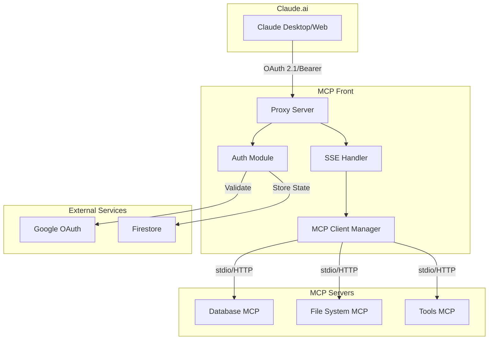
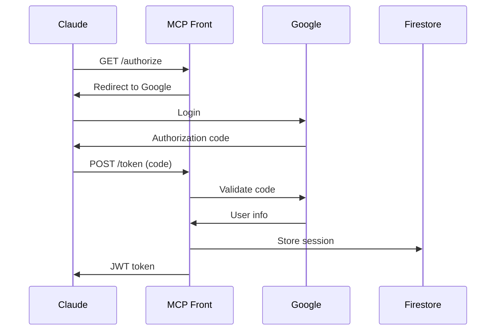
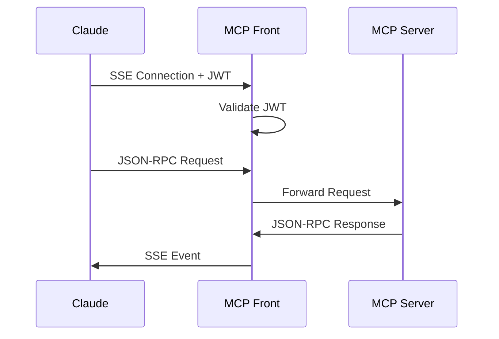

import { Aside } from '@astrojs/starlight/components';

## Overview

MCP Front is designed as a secure, high-performance proxy that sits between Claude.ai and your internal MCP servers. It provides authentication, authorization, and protocol translation in a single, lightweight service.

## System Architecture



## Core Components

### 1. Proxy Server (`internal/server`)

The main HTTP server that:
- Handles incoming requests from Claude.ai
- Routes requests to appropriate handlers
- Manages CORS for browser-based clients
- Provides health check endpoints

```go
// Key interfaces
type Server struct {
    config   *config.Config
    auth     AuthHandler
    clients  map[string]MCPClient
}
```

### 2. Authentication Module (`internal/oauth`)

Implements OAuth 2.1 with PKCE:
- Dynamic client registration (RFC 7591)
- Authorization code flow with PKCE
- JWT token generation and validation
- Google Workspace integration

<Aside type="tip">
  The OAuth module uses the [ory/fosite](https://github.com/ory/fosite) library, which is fully compliant with OAuth 2.1 specifications.
</Aside>

### 3. MCP Client Manager (`internal/client`)

Manages connections to MCP servers:
- Spawns stdio-based servers as subprocesses
- Maintains HTTP connections to remote servers
- Handles protocol translation (JSON-RPC over SSE)
- Manages connection lifecycle

### 4. SSE Handler

Implements Server-Sent Events for real-time streaming:
- Bidirectional communication over HTTP
- Automatic reconnection handling
- Request/response correlation
- Error propagation

## Data Flow

### Authentication Flow



### Request Flow



## Security Architecture

### Defense in Depth

1. **Network Layer**
   - TLS encryption for all external communications
   - Internal network isolation for MCP servers
   - Firewall rules limiting ingress/egress

2. **Authentication Layer**
   - OAuth 2.1 with PKCE prevents token theft
   - JWT tokens with short TTL (configurable)
   - Domain-based access restrictions

3. **Authorization Layer**
   - Per-server token validation
   - Configurable tool filtering
   - Request sanitization

4. **Application Layer**
   - Input validation on all requests
   - Output encoding for SSE events
   - Rate limiting (configurable)

### Threat Model

| Threat | Mitigation |
|--------|------------|
| Token theft | Short TTL, PKCE, secure storage |
| CSRF attacks | State parameter validation |
| Injection attacks | Input sanitization, parameterized queries |
| DoS attacks | Rate limiting, resource limits |
| Data leakage | TLS encryption, access logs |

## Scalability Design

### Horizontal Scaling

MCP Front is stateless (when using Firestore), allowing:
- Multiple instances behind a load balancer
- Auto-scaling based on CPU/memory
- Zero-downtime deployments

### Performance Optimizations

1. **Connection Pooling**
   - Reuse HTTP connections to MCP servers
   - Subprocess pooling for stdio servers

2. **Efficient Streaming**
   - Direct byte streaming without buffering
   - Minimal memory allocation

3. **Caching**
   - JWT validation results
   - OAuth discovery metadata

## Deployment Architecture

### Docker Container

```dockerfile
# Multi-stage build for minimal image
FROM golang:1.21 AS builder
# Build static binary

FROM alpine:latest
# Minimal runtime with security updates
```

### Cloud Native

Designed for:
- Kubernetes with health/liveness probes
- Google Cloud Run with automatic scaling
- AWS ECS/Fargate deployment

## Monitoring and Observability

### Structured Logging

All logs use structured format:
```json
{
  "time": "2024-01-15T10:30:00Z",
  "level": "INFO",
  "msg": "Request processed",
  "method": "POST",
  "path": "/token",
  "duration": "125ms",
  "status": 200
}
```

### Metrics

Key metrics exposed:
- Request rate and latency
- Authentication success/failure
- MCP server health
- Active connections

### Health Checks

```http
GET /health
{
  "status": "ok",
  "service": "mcp-front",
  "version": "1.0.0",
  "uptime": "24h35m"
}
```

## Development Architecture

### Project Structure

```
mcp-front/
├── cmd/mcp-front/      # Main application entry
├── internal/           # Internal packages
│   ├── config/        # Configuration parsing
│   ├── oauth/         # OAuth implementation
│   ├── server/        # HTTP server
│   └── client/        # MCP client
├── integration/       # Integration tests
└── docs/             # Documentation
```

### Testing Strategy

1. **Unit Tests**: Core business logic
2. **Integration Tests**: OAuth flows, MCP protocol
3. **Security Tests**: Injection, authentication bypass
4. **Load Tests**: Performance under stress

## Future Architecture Considerations

### Planned Enhancements

1. **Plugin System**
   - Custom authentication providers
   - Request/response transformers
   - Additional storage backends

2. **Multi-tenancy**
   - Workspace isolation
   - Per-tenant configuration
   - Usage quotas

3. **Advanced Security**
   - mTLS for MCP connections
   - Hardware security module (HSM) support
   - Audit logging with immutable storage