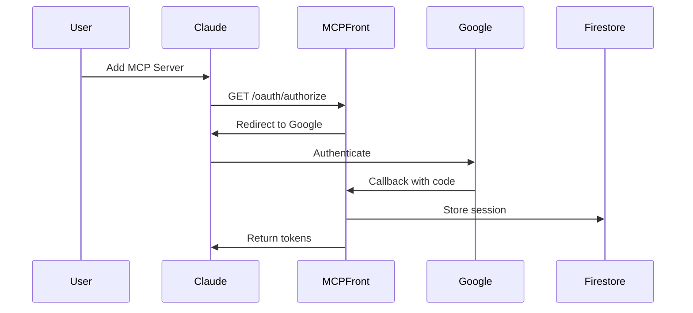
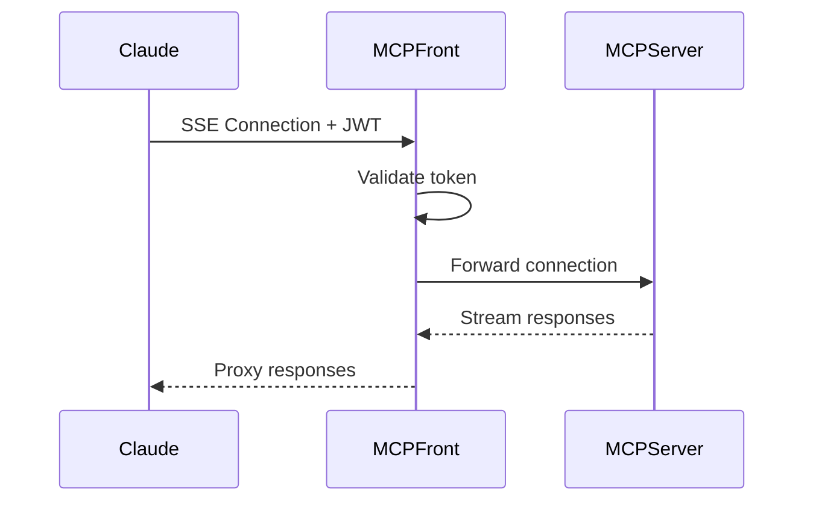

import { Aside } from '@astrojs/starlight/components';

This document captures the key architectural decisions made in MCP Front and the reasoning behind them.

## Overview

MCP Front is designed as a lightweight, secure proxy that bridges Claude.ai with Model Context Protocol (MCP) servers. The architecture prioritizes security, simplicity, and performance.

## Key Decisions

### 1. OAuth 2.1 with Fosite

**Decision**: Use Fosite library for OAuth 2.1 implementation

**Rationale**:
- Industry-standard OAuth implementation
- Built-in security features (PKCE mandatory)
- Extensible and well-maintained
- Supports latest OAuth 2.1 specifications

**Alternatives Considered**:
- Custom OAuth implementation - Too risky for security
- Other OAuth libraries - Less mature or feature-complete

### 2. Firestore for Storage

**Decision**: Use Google Firestore as primary storage backend

**Rationale**:
- Fully managed, no infrastructure overhead
- Real-time synchronization across instances
- Built-in security and encryption
- Cost-effective for session storage
- Scales automatically

**Alternatives Considered**:
- Redis - Requires infrastructure management
- PostgreSQL - Overkill for simple key-value storage
- In-memory - Not suitable for production

<Aside type="tip">
  Memory storage is still available for development, making it easy to get started without cloud dependencies.
</Aside>

### 3. Server-Sent Events (SSE) for MCP

**Decision**: Use SSE for proxying MCP protocol

**Rationale**:
- Native browser support
- Unidirectional streaming (server to client)
- Simple protocol, easy to debug
- Automatic reconnection
- Works through proxies and firewalls

**Alternatives Considered**:
- WebSockets - Bidirectional not needed, more complex
- Long polling - Less efficient for streaming
- gRPC-Web - Limited browser support

### 4. JWT for Session Management

**Decision**: Use JWT tokens with HMAC-SHA256 signing

**Rationale**:
- Stateless authentication
- Standard format, widely supported
- Contains user claims
- Can be validated without database lookup

**Trade-offs**:
- Cannot revoke individual tokens (mitigated by short expiry)
- Token size larger than session IDs

### 5. Go Programming Language

**Decision**: Build MCP Front in Go

**Rationale**:
- Excellent performance
- Strong standard library
- Built-in concurrency primitives
- Easy deployment (single binary)
- Good cloud provider support

**Alternatives Considered**:
- Node.js - Higher memory usage, callback complexity
- Python - Performance concerns at scale
- Rust - Steeper learning curve

## Security Architecture

### Defense in Depth

```
┌─────────────────┐
│   Claude.ai     │
└────────┬────────┘
         │ HTTPS + OAuth
┌────────┴────────┐
│   MCP Front     │ ← Domain restrictions
├─────────────────┤   PKCE required
│ - Auth layer    │   JWT validation
│ - Proxy layer   │   Rate limiting
│ - Audit layer   │   Security headers
└────────┬────────┘
         │ SSE/HTTP
┌────────┴────────┐
│  MCP Servers    │
└─────────────────┘
```

### Security Layers

1. **Network Layer**
   - HTTPS only
   - TLS 1.2+ required
   - Certificate pinning (optional)

2. **Authentication Layer**
   - OAuth 2.1 with PKCE
   - Domain-based access control
   - Google Workspace integration

3. **Authorization Layer**
   - JWT token validation
   - Scope-based permissions
   - Server-specific access control

4. **Application Layer**
   - Input validation
   - Rate limiting
   - Security headers

## Data Flow Architecture

### OAuth Flow



### MCP Proxy Flow



## Scalability Considerations

### Horizontal Scaling

MCP Front is stateless (except for SSE connections), enabling easy horizontal scaling:

```yaml
# Kubernetes example
apiVersion: apps/v1
kind: Deployment
spec:
  replicas: 3  # Scale based on load
  template:
    spec:
      containers:
      - name: mcp-front
        resources:
          requests:
            memory: "256Mi"
            cpu: "250m"
          limits:
            memory: "512Mi"
            cpu: "500m"
```

### Connection Management

- Each instance handles up to 1000 concurrent SSE connections
- Connection state not shared between instances
- Client reconnects handled gracefully

### Performance Optimizations

1. **Connection Pooling**: Reuse HTTP connections to MCP servers
2. **Caching**: Cache OAuth discovery documents
3. **Compression**: Disabled for SSE to maintain streaming
4. **Buffering**: Disabled for real-time performance

## Configuration Philosophy

### Environment-Aware

```json
{
  "proxy": {
    "auth": {
      "jwtSecret": "$env:JWT_SECRET",
      "googleClientId": "$env:GOOGLE_CLIENT_ID"
    }
  }
}
```

**Rationale**:
- Secrets never in configuration files
- Easy deployment across environments
- Follows 12-factor app principles

### Validation-First

All configuration is validated on startup:
- Required fields checked
- Value constraints enforced
- Early failure for misconfigurations

## Error Handling Strategy

### Fail Fast

- Invalid configuration: Exit immediately
- Missing dependencies: Exit immediately
- Runtime errors: Log and continue

### Error Responses

Consistent error format across all endpoints:

```json
{
  "error": "error_code",
  "error_description": "Human-readable description",
  "error_uri": "https://docs.mcp-front.com/errors/error_code"
}
```

## Monitoring and Observability

### Structured Logging

```json
{
  "time": "2024-01-15T10:30:00Z",
  "level": "INFO",
  "msg": "Request completed",
  "request_id": "abc-123",
  "method": "GET",
  "path": "/oauth/authorize",
  "status": 302,
  "duration_ms": 45,
  "user_id": "user@company.com"
}
```

### Metrics

Key metrics exposed:
- Request rate and latency
- Active SSE connections
- OAuth success/failure rates
- Token generation time
- Error rates by type

### Health Checks

```go
// Liveness: Is the process running?
GET /health -> 200 OK

// Readiness: Can it serve traffic?
GET /ready -> 200 OK (with dependency checks)
```

## Future Considerations

### Planned Enhancements

1. **Multi-region support**: Global load balancing
2. **Caching layer**: Reduce Firestore reads
3. **WebSocket support**: For bidirectional MCP
4. **Plugin system**: Extensible authentication

### Technical Debt

1. **Token revocation**: Implement token blacklist
2. **Session migration**: Zero-downtime updates
3. **Connection draining**: Graceful shutdown

<Aside type="caution">
  These are considerations for future versions. The current architecture handles most production use cases effectively.
</Aside>

## Decision Record Template

For new architectural decisions:

```markdown
## ADR-XXX: Title

### Status
Proposed/Accepted/Deprecated

### Context
What is the issue we're addressing?

### Decision
What are we going to do?

### Consequences
What are the trade-offs?

### Alternatives
What else did we consider?
```

## Next Steps

- Review [Security Best Practices](/mcp-front/oauth/security/)
- Understand [Testing Strategy](/mcp-front/dev/testing/)
- Learn about [Deployment Options](/mcp-front/deployment/production/)