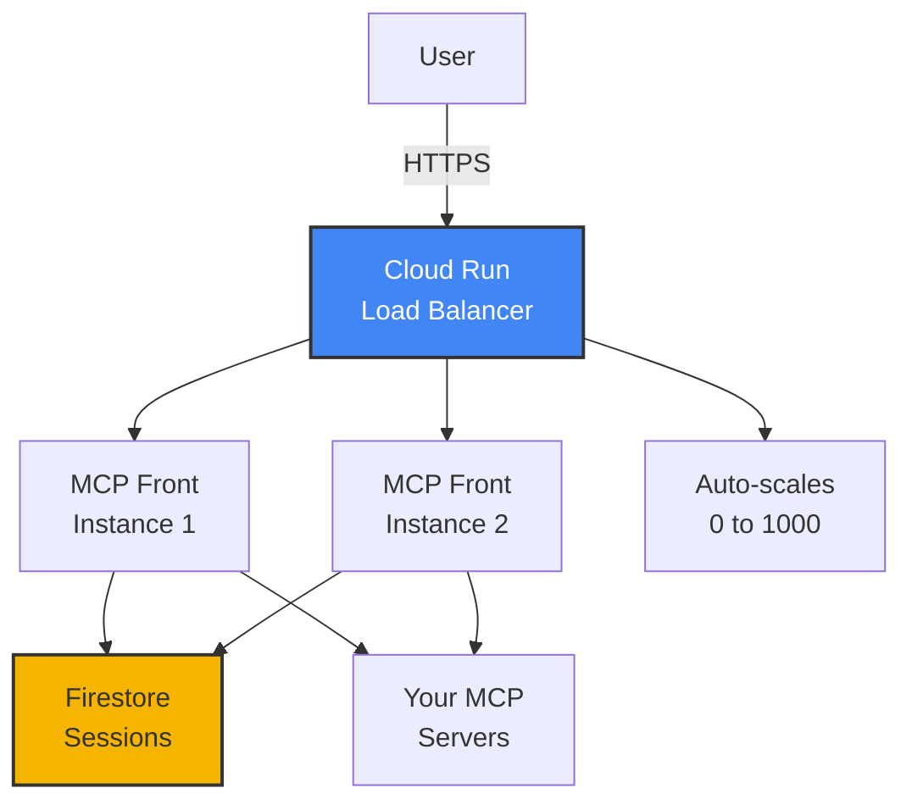

Cloud Run is the easiest way to deploy MCP Front to production. You get automatic HTTPS, scaling, and Google's infrastructure.

## Why Cloud Run?



Benefits:

- **Zero to hero scaling**: Scales down to 0 when unused, up to 1000s during load
- **Automatic HTTPS**: Google manages SSL certificates
- **Built-in monitoring**: Logs, metrics, and alerts included
- **Pay per request**: Only pay when handling traffic

## Prerequisites

- Google Cloud project with billing enabled
- `gcloud` CLI installed
- Docker installed locally

## 1. Prepare your config

Create `config.json` for production:

```json
{
  "version": "1.0",
  "proxy": {
    "name": "Production MCP Proxy",
    "baseUrl": "https://mcp-front-abc123-uc.a.run.app",
    "addr": ":8080",
    "auth": {
      "kind": "oauth",
      "issuer": "https://mcp-front-abc123-uc.a.run.app",
      "allowedDomains": ["company.com"],
      "storage": "firestore",
      "gcpProject": { "$env": "GOOGLE_CLOUD_PROJECT" }
    }
  },
  "mcpServers": {
    "database": {
      "url": { "$env": "DATABASE_MCP_URL" }
    }
  }
}
```

## 2. Create a Dockerfile

```dockerfile
FROM ghcr.io/dgellow/mcp-front:latest
COPY config.json /config.json
```

## 3. Build and push image

```bash
# Set your project ID
export PROJECT_ID="your-project-id"

# Build image
docker build -t gcr.io/$PROJECT_ID/mcp-front .

# Push to Container Registry
docker push gcr.io/$PROJECT_ID/mcp-front
```

## 4. Deploy to Cloud Run

```bash
gcloud run deploy mcp-front \
  --image gcr.io/$PROJECT_ID/mcp-front \
  --platform managed \
  --region us-central1 \
  --allow-unauthenticated \
  --set-env-vars "GOOGLE_CLIENT_ID=your-client-id" \
  --set-env-vars "GOOGLE_CLIENT_SECRET=your-secret" \
  --set-env-vars "JWT_SECRET=$(openssl rand -base64 32)" \
  --set-env-vars "DATABASE_MCP_URL=http://your-database-mcp:3000/sse"
```

## 5. Update OAuth redirect URI

Add your Cloud Run URL to Google OAuth:

```
https://mcp-front-abc123-uc.a.run.app/callback
```

## 6. Enable Firestore

OAuth requires Firestore for session storage in production:

```bash
# Enable Firestore API
gcloud services enable firestore.googleapis.com

# Create Firestore database (choose the closest region)
gcloud firestore databases create --location=us-central1
```

MCP Front will automatically create these collections:

- `oauth_clients` - Registered OAuth clients
- `oauth_sessions` - Active user sessions
- `oauth_tokens` - Refresh tokens

## Custom domain

Use a custom domain instead of the Cloud Run URL:

```bash
# Map domain
gcloud run domain-mappings create \
  --service mcp-front \
  --domain mcp.company.com \
  --region us-central1

# Update DNS records as instructed
```

## Secrets management

Use Secret Manager for sensitive values:

```bash
# Create secrets
echo -n "your-client-secret" | gcloud secrets create google-client-secret --data-file=-
echo -n "$(openssl rand -base64 32)" | gcloud secrets create jwt-secret --data-file=-

# Deploy with secrets
gcloud run deploy mcp-front \
  --image gcr.io/$PROJECT_ID/mcp-front \
  --set-secrets "GOOGLE_CLIENT_SECRET=google-client-secret:latest" \
  --set-secrets "JWT_SECRET=jwt-secret:latest"
```

## Monitoring

View logs:

```bash
gcloud run logs read --service=mcp-front
```

Set up alerts:

```bash
gcloud monitoring policies create \
  --notification-channels=your-channel-id \
  --display-name="MCP Front Errors" \
  --condition-display-name="Error rate > 1%" \
  --condition-expression='resource.type="cloud_run_revision" AND metric.type="run.googleapis.com/request_count" AND metric.label.response_code_class="5xx"'
```

## Cost optimization

### Pricing model

Cloud Run charges for:

- **CPU time**: Only when handling requests
- **Memory**: Allocated memory × time
- **Requests**: First 2 million/month free

### Typical costs

For a team of 50 users:

- ~100K requests/month
- ~$5-15/month total

### Cost controls

```bash
# Set maximum instances to prevent runaway costs
gcloud run services update mcp-front \
  --max-instances=10 \
  --min-instances=0 \
  --concurrency=100
```

### Development vs Production

```bash
# Development: Scale to zero when not in use
--min-instances=0

# Production: Keep 1 instance warm for faster response
--min-instances=1
```

## Production checklist

- [ ] OAuth credentials configured in Google Cloud Console
- [ ] Firestore enabled and database created
- [ ] Custom domain configured (optional)
- [ ] Secrets stored in Secret Manager
- [ ] Monitoring alerts configured
- [ ] Maximum instances limit set
- [ ] Health checks verified
