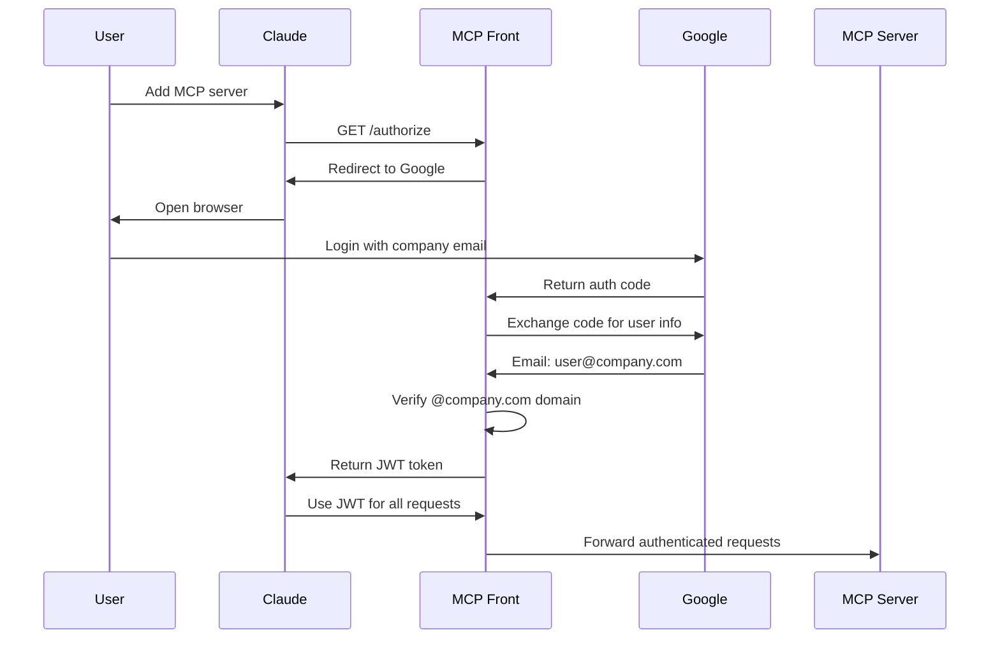

OAuth 2.1 authentication lets you control access based on company email domains. When someone connects from Claude, they'll log in with their Google account, and MCP Front verifies they're from your company.

## How OAuth works with MCP Front



## Prerequisites

- Google Cloud project
- Google Workspace domain (or any Google account for testing)
- Docker or the mcp-front binary

## 1. Set up Google OAuth

### Create OAuth credentials

1. Go to [Google Cloud Console](https://console.cloud.google.com)
2. Create a new OAuth 2.0 Client ID:
   - Type: Web application
   - Name: MCP Front
   - Authorized redirect URIs:
     - `http://localhost:8080/callback` (for testing)
     - `https://mcp.company.com/callback` (for production)

### Configure OAuth consent screen

1. Choose "Internal" for Google Workspace
2. Add scopes: email, profile, openid
3. Save

## 2. Configure MCP Front

Create `config.json`:

```json
{
  "version": "1.0",
  "proxy": {
    "name": "Company MCP Proxy",
    "baseUrl": "https://mcp.company.com",
    "addr": ":8080",
    "auth": {
      "kind": "oauth",
      "issuer": "https://mcp.company.com",
      "allowedDomains": ["company.com"]
    }
  },
  "mcpServers": {
    "database": {
      "url": "http://postgres-mcp:3000/sse"
    }
  }
}
```

## 3. Set environment variables

```bash
export GOOGLE_CLIENT_ID="your-client-id.apps.googleusercontent.com"
export GOOGLE_CLIENT_SECRET="your-client-secret"
export JWT_SECRET=$(openssl rand -base64 32)
```

## 4. Run with Docker

```bash
docker run -p 8080:8080 \
  -e GOOGLE_CLIENT_ID \
  -e GOOGLE_CLIENT_SECRET \
  -e JWT_SECRET \
  -v $(pwd)/config.json:/config.json \
  ghcr.io/dgellow/mcp-front:latest
```

## 5. Connect from Claude

1. In Claude settings, add MCP server:
   - URL: `https://mcp.company.com/sse`
   - Auth Type: OAuth
2. Claude will open a browser for Google login
3. Sign in with your company email
4. You're connected!

## Understanding domain restrictions

The `allowedDomains` field is your primary security control. Only users with email addresses from these domains can access your MCP servers:

```json
{
  "allowedDomains": ["company.com", "subsidiary.com"]
}
```

How it works:

- User logs in: john@company.com ✓ Allowed
- User logs in: jane@subsidiary.com ✓ Allowed
- User logs in: hacker@gmail.com ✗ Rejected

This is perfect for companies using Google Workspace, as it automatically grants access to all employees while blocking external users.

## Production requirements

### Why Firestore?

In development, OAuth clients are stored in memory and lost on restart. In production, you need persistent storage:

```json
{
  "auth": {
    "kind": "oauth",
    "storage": "firestore", // Required for production
    "gcpProject": "my-project-123"
  }
}
```

Firestore stores:

- OAuth client registrations
- User sessions
- Refresh tokens

### HTTPS is mandatory

OAuth 2.1 requires HTTPS in production:

```json
{
  "baseUrl": "https://mcp.company.com", // Must be HTTPS
  "issuer": "https://mcp.company.com" // Must be HTTPS
}
```

Options for HTTPS:

- **Cloud Run**: Automatic HTTPS with Google-managed certificates
- **Load Balancer**: Terminate SSL at the load balancer
- **Reverse Proxy**: Use nginx/caddy with Let's Encrypt

### Token expiration

Configure token lifetime based on your security requirements:

```json
{
  "tokenTTL": "4h" // Shorter = more secure, but more logins
}
```

Common settings:

- Development: "24h" (less frequent logins)
- Production: "4h" (balance security/usability)
- High security: "1h" (financial/healthcare)

## Troubleshooting

**"Redirect URI mismatch"**

- Ensure the callback URL in Google Console matches exactly
- Include the port if non-standard

**"Domain not allowed"**

- Check user's email domain is in allowedDomains
- Verify Google Workspace user exists

**"JWT secret too short"**

- JWT secret must be 32+ bytes
- Generate with: `openssl rand -base64 32`
