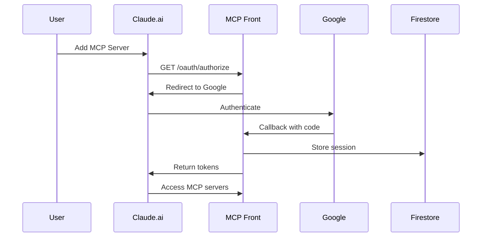

import { Aside, Code, Tabs, TabItem } from '@astrojs/starlight/components';

MCP Front implements OAuth 2.1 authentication using the [Fosite](https://github.com/ory/fosite) library, providing secure access control for your MCP servers.

## OAuth 2.1 Features

### Core Implementation

- **Authorization Code Flow** with PKCE (required)
- **Client Authentication** supporting both public and confidential clients
- **JWT-based tokens** using HMAC-SHA512/256
- **Refresh tokens** for long-lived sessions
- **State parameter** with configurable entropy
- **OpenID Connect** compatible

### Security Features

- **PKCE mandatory** for all authorization flows
- **State parameter validation** to prevent CSRF
- **Secure token storage** in Firestore
- **Domain-based access control**
- **Automatic token rotation**
- **Session management**

<Aside type="tip">
  OAuth 2.1 combines the best practices from OAuth 2.0 and makes security features like PKCE mandatory.
</Aside>

## How It Works

### Authentication Flow



### Token Types

| Token | Purpose | Lifetime | Storage |
|-------|---------|----------|----------|
| Access Token | API access | 1 hour | In-memory |
| Refresh Token | Token renewal | 30 days | Firestore |
| ID Token | User identity | 1 hour | Not stored |

## Configuration

### Basic OAuth Setup

<Code code={`{
  "proxy": {
    "auth": {
      "kind": "oauth",
      "issuer": "https://mcp.company.com",
      "allowedDomains": ["company.com"],
      "jwtSecret": "$env:JWT_SECRET",
      "googleClientId": "$env:GOOGLE_CLIENT_ID",
      "googleClientSecret": "$env:GOOGLE_CLIENT_SECRET",
      "storage": "firestore",
      "firestoreProjectId": "my-project"
    }
  }
}`} lang="json" title="Basic OAuth Configuration" />

### Advanced Configuration

<Code code={`{
  "proxy": {
    "auth": {
      "kind": "oauth",
      "issuer": "https://mcp.company.com",
      "allowedDomains": ["company.com", "subsidiary.com"],
      "jwtSecret": "$env:JWT_SECRET",
      "googleClientId": "$env:GOOGLE_CLIENT_ID",
      "googleClientSecret": "$env:GOOGLE_CLIENT_SECRET",
      "storage": "firestore",
      "firestoreProjectId": "my-project",
      "firestoreDatabase": "production",
      "firestoreCollection": "oauth_sessions",
      "sessionTimeout": "8h",
      "refreshTokenTimeout": "30d",
      "maxSessionsPerUser": 5,
      "requireEmailVerification": true
    }
  }
}`} lang="json" title="Advanced OAuth Configuration" />

## OAuth Endpoints

### Discovery Endpoint

```bash
GET /oauth/.well-known/openid-configuration
```

Returns OAuth 2.1 server metadata:

```json
{
  "issuer": "https://mcp.company.com",
  "authorization_endpoint": "https://mcp.company.com/oauth/authorize",
  "token_endpoint": "https://mcp.company.com/oauth/token",
  "userinfo_endpoint": "https://mcp.company.com/oauth/userinfo",
  "jwks_uri": "https://mcp.company.com/oauth/jwks",
  "response_types_supported": ["code"],
  "grant_types_supported": ["authorization_code", "refresh_token"],
  "code_challenge_methods_supported": ["S256"],
  "token_endpoint_auth_methods_supported": ["client_secret_basic", "client_secret_post"]
}
```

### Authorization Endpoint

```bash
GET /oauth/authorize
  ?client_id={client_id}
  &redirect_uri={redirect_uri}
  &response_type=code
  &scope=openid%20profile%20email
  &state={state}
  &code_challenge={challenge}
  &code_challenge_method=S256
```

### Token Endpoint

```bash
POST /oauth/token
Content-Type: application/x-www-form-urlencoded

grant_type=authorization_code
&code={authorization_code}
&redirect_uri={redirect_uri}
&client_id={client_id}
&client_secret={client_secret}
&code_verifier={verifier}
```

## Client Registration

### Dynamic Registration

<Code code={`POST /oauth/register
Content-Type: application/json
Authorization: Bearer {admin_token}

{
  "client_name": "Claude Desktop",
  "redirect_uris": [
    "http://localhost:3000/callback",
    "claude://callback"
  ],
  "grant_types": ["authorization_code", "refresh_token"],
  "response_types": ["code"],
  "scope": "openid profile email",
  "token_endpoint_auth_method": "client_secret_basic"
}`} lang="json" title="Client Registration Request" />

Response (201 Created):
```json
{
  "client_id": "abc123",
  "client_secret": "secret456",
  "client_name": "Claude Desktop",
  "redirect_uris": ["http://localhost:3000/callback", "claude://callback"],
  "grant_types": ["authorization_code", "refresh_token"],
  "response_types": ["code"],
  "scope": "openid profile email",
  "client_secret_expires_at": 0
}
```

### Client Types

<Tabs>
<TabItem label="Public Client">
```json
{
  "client_name": "Claude Web App",
  "redirect_uris": ["https://claude.ai/callback"],
  "grant_types": ["authorization_code"],
  "token_endpoint_auth_method": "none",
  "public": true
}
```
Public clients cannot securely store secrets (e.g., SPAs, mobile apps).
</TabItem>
<TabItem label="Confidential Client">
```json
{
  "client_name": "Claude Backend Service",
  "redirect_uris": ["https://api.claude.ai/callback"],
  "grant_types": ["authorization_code", "refresh_token"],
  "token_endpoint_auth_method": "client_secret_basic",
  "public": false
}
```
Confidential clients can securely store secrets (e.g., backend services).
</TabItem>
</Tabs>

## Security Considerations

### PKCE (Proof Key for Code Exchange)

PKCE is mandatory for all clients:

```javascript
// Generate code verifier
const verifier = base64url(crypto.randomBytes(32));

// Generate code challenge
const challenge = base64url(crypto.createHash('sha256').update(verifier).digest());

// Use in authorization request
const authUrl = `https://mcp.company.com/oauth/authorize?
  client_id=${clientId}&
  code_challenge=${challenge}&
  code_challenge_method=S256&...`;

// Use verifier in token exchange
const tokenResponse = await fetch('/oauth/token', {
  method: 'POST',
  body: new URLSearchParams({
    grant_type: 'authorization_code',
    code: authorizationCode,
    code_verifier: verifier,
    // ...
  })
});
```

### State Parameter

The state parameter prevents CSRF attacks:

```javascript
// Generate state
const state = base64url(crypto.randomBytes(32));

// Store state locally
sessionStorage.setItem('oauth_state', state);

// Include in authorization request
const authUrl = `https://mcp.company.com/oauth/authorize?state=${state}&...`;

// Verify on callback
if (callbackState !== sessionStorage.getItem('oauth_state')) {
  throw new Error('State mismatch - possible CSRF attack');
}
```

### Token Security

1. **JWT Secret Requirements**
   - Minimum 32 bytes (256 bits)
   - Use cryptographically secure random generation
   - Rotate regularly

2. **Token Storage**
   - Never store tokens in localStorage
   - Use secure, httpOnly cookies when possible
   - Implement token rotation

3. **Token Validation**
   - Verify JWT signature
   - Check expiration
   - Validate issuer and audience

## Session Management

### Session Storage

Sessions are stored in Firestore with this structure:

```json
{
  "session_id": "sess_abc123",
  "user_id": "user_456",
  "email": "user@company.com",
  "domain": "company.com",
  "created_at": "2024-01-15T10:00:00Z",
  "expires_at": "2024-01-15T18:00:00Z",
  "last_accessed": "2024-01-15T14:30:00Z",
  "ip_address": "192.168.1.1",
  "user_agent": "Claude Desktop/1.0",
  "scopes": ["openid", "profile", "email"]
}
```

### Session Lifecycle

1. **Creation**: On successful authentication
2. **Validation**: On each request
3. **Refresh**: Via refresh token
4. **Expiration**: After timeout or explicit logout
5. **Cleanup**: Automatic removal of expired sessions

## Troubleshooting

### Common Issues

#### "Invalid client" Error

```json
{
  "error": "invalid_client",
  "error_description": "Client authentication failed"
}
```

**Solutions**:
- Verify client_id and client_secret
- Check token endpoint auth method
- Ensure client is registered

#### "Invalid grant" Error

```json
{
  "error": "invalid_grant",
  "error_description": "Authorization code is invalid or expired"
}
```

**Solutions**:
- Authorization codes expire after 10 minutes
- Codes can only be used once
- Verify redirect_uri matches exactly

#### PKCE Errors

```json
{
  "error": "invalid_request",
  "error_description": "Code verifier does not match challenge"
}
```

**Solutions**:
- Ensure using SHA256 for challenge
- Verify base64url encoding (no padding)
- Check verifier length (43-128 characters)

### Debug Mode

Enable debug logging for troubleshooting:

```bash
export MCP_FRONT_ENV=development
export LOG_LEVEL=debug
./mcp-front -config config.json
```

Debug logs include:
- Token generation details
- Session creation/validation
- Client authentication attempts
- PKCE verification steps

## Best Practices

### For Implementers

1. **Always use HTTPS** in production
2. **Implement token rotation** for long-lived sessions
3. **Monitor failed authentication** attempts
4. **Set appropriate session timeouts**
5. **Use domain allowlists** for access control

### For Users

1. **Register dedicated OAuth clients** for each application
2. **Use strong client secrets** for confidential clients
3. **Implement proper token storage** in your application
4. **Handle token refresh** gracefully
5. **Log out properly** to clean up sessions

## Migration from Bearer Tokens

### Step 1: Enable OAuth alongside Bearer

```json
{
  "auth": {
    "kind": "oauth",
    "fallbackBearerTokens": {
      "migration-token": "temporary-token"
    }
  }
}
```

### Step 2: Migrate Clients

1. Register OAuth clients
2. Update client configurations
3. Test OAuth flow
4. Monitor both auth methods

### Step 3: Disable Bearer Tokens

```json
{
  "auth": {
    "kind": "oauth"
    // Remove fallbackBearerTokens
  }
}
```

## Next Steps

- Configure [Google Workspace Integration](/mcp-front/oauth/google-workspace/)
- Set up [Firestore Storage](/mcp-front/oauth/firestore/)
- Review [Security Best Practices](/mcp-front/oauth/security/)