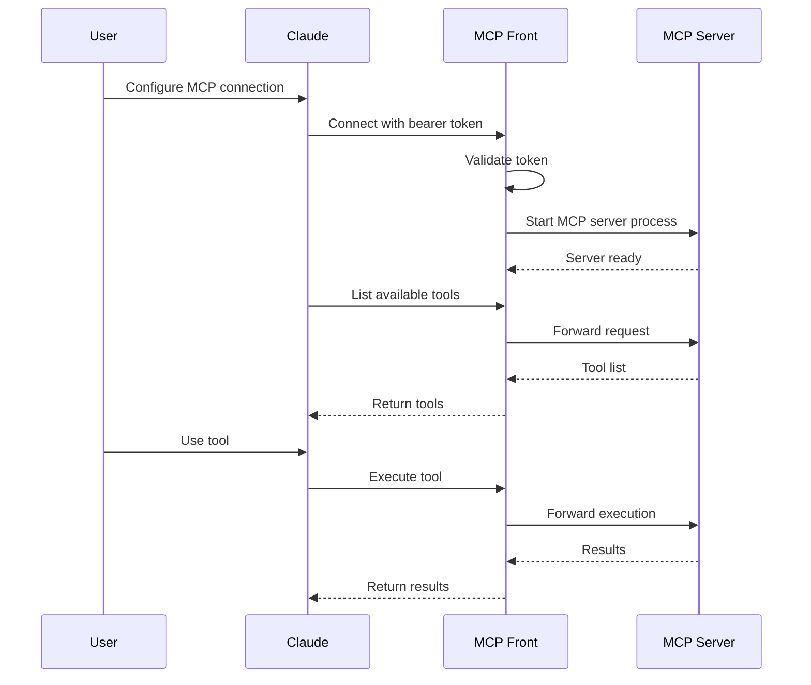

This guide gets you running with bearer token authentication. For production deployments with OAuth, see the [OAuth example](/examples/oauth-google/).

## How it works



## 1. Create a config file

Create `config.json` with a basic MCP server:

```json
{
  "version": "v0.0.1-DEV_EDITION_EXPECT_CHANGES",
  "proxy": {
    "name": "My MCP Proxy",
    "addr": ":8080",
    "auth": {
      "kind": "bearerToken",
      "tokens": {
        "filesystem": ["my-secret-token"]
      }
    }
  },
  "mcpServers": {
    "filesystem": {
      "transportType": "stdio",
      "command": "npx",
      "args": ["-y", "@modelcontextprotocol/server-filesystem", "/tmp"]
    }
  }
}
```

## 2. Run MCP Front

You have three options:

### Option A: Docker (recommended)

```bash
docker run -p 8080:8080 \
  -v $(pwd)/config.json:/config.json \
  ghcr.io/dgellow/mcp-front:latest
```

### Option B: Download binary

```bash
# macOS (Apple Silicon)
curl -L https://github.com/dgellow/mcp-front/releases/latest/download/mcp-front-darwin-arm64 -o mcp-front

# macOS (Intel)
curl -L https://github.com/dgellow/mcp-front/releases/latest/download/mcp-front-darwin-amd64 -o mcp-front

# Linux
curl -L https://github.com/dgellow/mcp-front/releases/latest/download/mcp-front-linux-amd64 -o mcp-front

# Then run
chmod +x mcp-front
./mcp-front -config config.json
```

### Option C: Build from source

```bash
git clone https://github.com/dgellow/mcp-front
cd mcp-front
go build -o mcp-front ./cmd/mcp-front
./mcp-front -config config.json
```

## 3. Connect from Claude

Open Claude Desktop settings and add a new MCP server. Set the URL to `http://localhost:8080/sse`, auth type to Bearer Token, and token to `my-secret-token`. Save and restart Claude.

## 4. Test it

Ask Claude: "What MCP tools do you have available?"

You should see the filesystem tools from your MCP server.

## What's next?

Switch to [OAuth authentication](/examples/oauth-google/) for production. [Deploy to Cloud Run](/examples/cloud-run/) for automatic scaling. [Add more MCP servers](/configuration#mcp-servers) to your config.

## Troubleshooting

### Connection refused

```bash
# Check if MCP Front is running
curl http://localhost:8080/health
# Should return: {"status":"ok","service":"mcp-front"}
```

If not running, check the process is actually running. Verify port 8080 isn't already in use. Make sure firewall rules allow localhost connections.

### Authentication failed

The token in Claude must be in the list for that server:

```json
{
  "auth": {
    "tokens": {
      "filesystem": ["my-secret-token"] // <- Token must be in this array
    }
  }
}
```

Check logs for details:

```bash
# Docker
docker logs <container-id>

# Binary
# Logs print to stdout
```

### No tools available

This usually means MCP Front can't start your MCP server:

1. Test the MCP server directly:

```bash
npx -y @modelcontextprotocol/server-filesystem /tmp
# Should output JSON-RPC messages
```

2. Check MCP Front logs for errors
3. Ensure the command is in PATH
4. For Docker, make sure the MCP server is accessible from the container
